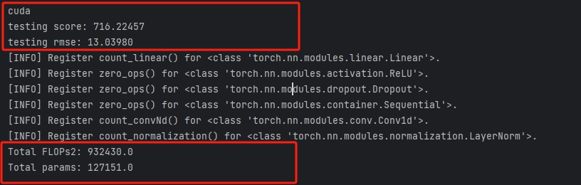
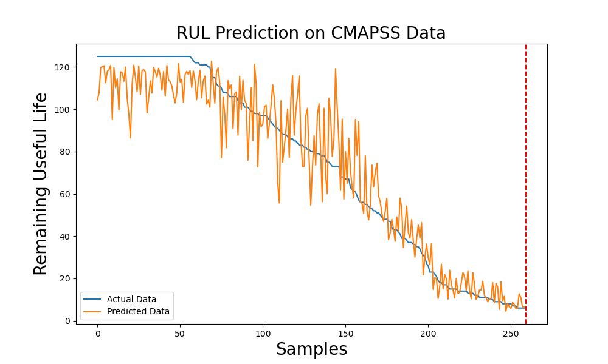

## PVA-FFG-Transformer for RUL Prediction (C-MAPSS)
_A remaining useful life prediction method based on predictive vector angle minimization and feature fusion gate improved transformer model_

_Author: Zhou Zhihao,Harbin Institute of Technology_

## Attention
**This program is used for result reproduction and further research.
This work improves both the loss function and the model. The model given is for the general case of performance of the proposed method. 
If you are interested in the method, please contact this email address. We will send you the complete program. 
Email:22S002045@stu.hit.edu.cn**

## Quick Run
Simply run `main`. 

## Training
The training program is not available at this time because the content has not yet been published in either journal.

## Testing
Run "main.py" directly, and then you can see the predicted RMSE, Score, and the number of model parameters.
Take FD002 for example.

The prediction results for all test engines are shown below.


## Environment Details
```
python==3.10
numpy==1.23.5
pandas==1.5.3
matplotlib==3.7.0
pytorch==2.0.1+cu118
```